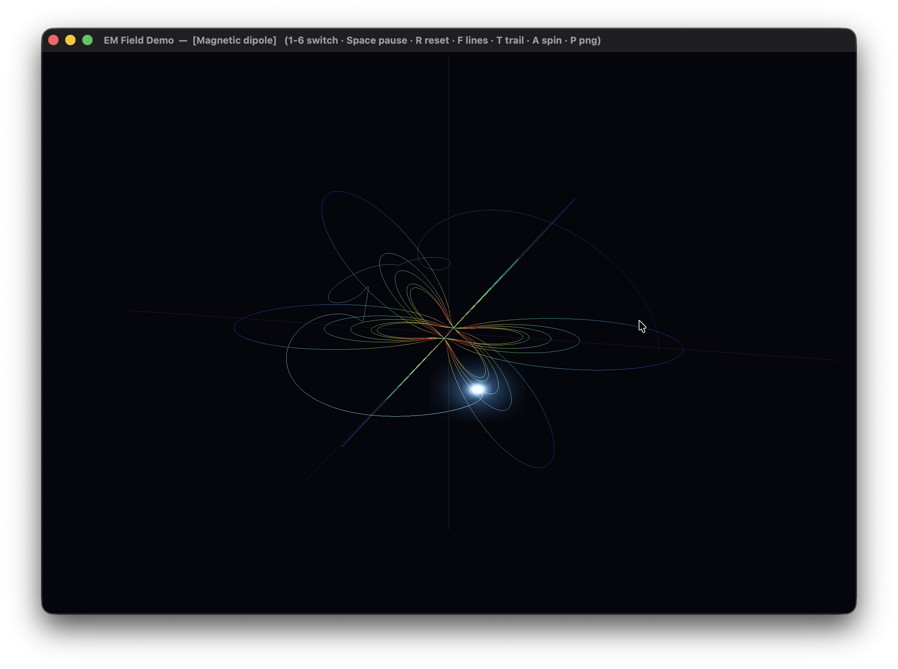

# EM Field Demo

A real-time visualization of a charged particle moving through electromagnetic
fields, with live tracing of the field lines. Written in **Swift + Metal**, no
third-party dependencies, in a single source file.

Six configurations are included: a magnetic dipole, a magnetic quadrupole, a
cyclotron, a magnetic bottle, an electric dipole, and an electric quadrupole.
The particle is integrated with a **Boris pusher**; the field lines are traced
on the CPU with RK4 and coloured by local field strength.

> Press **P** at any time to save a 1920×1080 PNG of the current frame.

## Screenshot
  

## Scenarios

| Key | Name | Field | What you see |
|----|------|-------|--------------|
| 1 | Magnetic dipole | `B ∝ [3(m·r̂)r̂ − m]/r³`, axis = z | A particle trapped in dipole field lines — spirals along a line and mirrors near the poles, like motion in a radiation belt. |
| 2 | Magnetic quadrupole | `B = (g·y, g·x, 0)` | Hyperbolic field lines; the particle is focused in one transverse plane and defocused in the other (accelerator-style focusing). |
| 3 | Cyclotron | `B = (0, 0, B₀)` (uniform) | The textbook helix: constant gyration plus a drift along the axis. |
| 4 | Magnetic bottle | `B_z = B₀(1 + z²/L²)`, `B_⊥ = −B₀·z·r/L²` | A magnetic mirror. The particle bounces back and forth between the high-field throats. The field is divergence-free by construction (`∇·B = 0`). |
| 5 | Electric dipole | Coulomb sum of `+q` and `−q` | Field lines run from the positive to the negative charge; the test charge is deflected as it passes through. |
| 6 | Electric quadrupole | Four point charges (`+,+` on x, `−,−` on y) | The characteristic four-lobe pattern; the test charge follows a scattering trajectory. |

In the magnetic scenarios the field does no work, so the kinetic energy is
conserved and orbits stay bounded. In the electric scenarios the `E` field does
real work — the particle speeds up and slows down — so it is automatically
re-injected at its start state once it leaves the view volume.

---

## Build

Requires macOS with a Metal-capable GPU and the Swift toolchain
(Xcode or the Command Line Tools: `xcode-select --install`).

```sh
# optimized binary
./build.sh

# build and run
./build.sh run

# build a double-clickable EMFieldDemo.app
./build.sh app

# remove artifacts
./build.sh clean
```

Or compile by hand:

```sh
swiftc -O EMFieldDemo.swift -o EMFieldDemo \
    -framework Cocoa -framework Metal -framework MetalKit
./EMFieldDemo
```

There is no Xcode project and no `.metallib` step — the Metal shaders are
compiled at runtime via `MTLDevice.makeLibrary(source:)`.

---

## Controls

| Input | Action |
|-------|--------|
| `1` … `6` | switch scenario |
| `Space` | pause / resume |
| `R` | reset the particle |
| `F` | toggle field lines |
| `T` | toggle the trajectory trail |
| `A` | toggle camera auto-rotation |
| `P` | save a PNG of the current frame |
| mouse drag | orbit the camera |
| scroll | zoom |

---

## How it works

**Integrator — Boris pusher.** Velocity is advanced with a symmetric pair of
half-kicks by `E` around an exact rotation by `B`. The magnetic rotation
preserves speed, so the scheme conserves energy for the magnetic part over long
runs without the drift a naive Euler/RK integrator would accumulate.

**Field-line tracing.** From a set of seed points, lines are integrated with
RK4 along the normalized field. Magnetic lines are traced in both directions;
electric lines are traced forward from rings around the positive charges and
stop when they reach a charge. Each vertex is coloured by `log|field|` through a
five-stop cool-to-warm map; spatially uniform fields get a single flat colour.

**Point-charge fields** use a softened Coulomb law (`r → max(|d|, ε)`) so the
trajectory and the traced lines stay finite near a charge.

**Rendering — Metal.** Field lines and the fading trail are drawn as
line primitives with alpha blending against a depth buffer. The particle is two
additive billboard quads (a soft halo and a bright core) with a Gaussian
falloff, giving a luminous point without a full bloom pass. An orbit camera with
optional auto-rotation frames the scene.

**PNG export** renders the scene off-screen at 1920×1080 into a private texture,
blits it into a buffer (row pitch aligned to 256 bytes), and writes a file with
ImageIO. Frames are saved to the current working directory as
`emfield_<timestamp>.png`, so run the binary from a terminal when capturing.

---

## Tuning notes

The initial conditions and field strengths are chosen so each scenario reads
clearly on screen; all of them live in the `Scenarios` factory functions and are
meant to be edited.

- **Magnetic dipole** is the most sensitive: the gyroradius must be noticeably
  smaller than the field scale for the particle to follow a line adiabatically.
  Adjust `q` and `initialVel` in `Scenarios.dipole()`.
- **Magnetic quadrupole** has `B_z = 0`, so nothing confines motion along the
  axis — the particle crosses through and is re-injected. Add a uniform `B_z`
  component for a closed, bounded orbit.
- **Electric scenarios** are scattering passes, not bound orbits, so the
  trajectory depends strongly on where and how fast the test charge starts.

---

## Requirements

- macOS 11 or later (uses `UniformTypeIdentifiers` for PNG export)
- A Metal-capable GPU (Apple Silicon, or any recent Metal Mac)
- Swift toolchain (Xcode or Command Line Tools)

## License

MIT — do whatever you like; attribution appreciated.

## Support

If you found this project interesting or useful, you can support my work:

[](https://github.com/sponsors/makarov-mm)