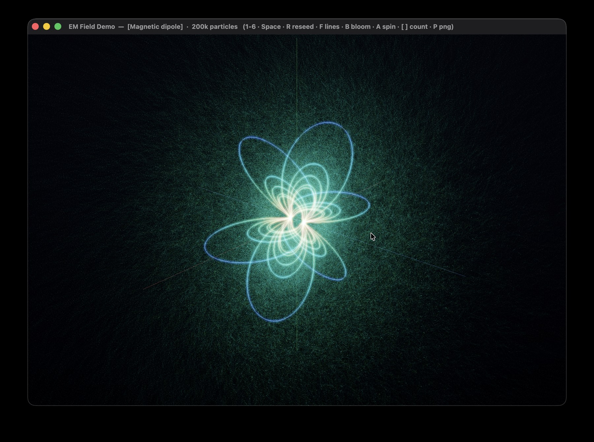

# EM Field Demo

A GPU particle-swarm visualization of charged-particle motion in electromagnetic
fields: **200,000+ test charges** pushed through analytic E/B fields entirely on
the GPU (Boris pusher in a Metal compute kernel), rendered as additive HDR point
sprites with light-painted trails, glowing field lines, and a bloom post pass.

Written in **Swift + Metal**, single source file, no third-party dependencies,
no Xcode project — the Metal shaders are compiled at runtime via
`MTLDevice.makeLibrary(source:)`.

> Press **P** at any time to save a PNG of the current frame, or **O** for a
> 2× supersampled one.

## Screenshot



## Scenarios

| Key | Name | Field | What you see |
|----|------|-------|--------------|
| 1 | Magnetic dipole | `B ∝ [3(m·r̂)r̂ − m]/r³`, axis = z | Particles trapped on dipole field lines — they spiral along a line and mirror near the poles, like radiation-belt motion. |
| 2 | Magnetic quadrupole | `B = (g·y, g·x, 0)` | Hyperbolic field lines; particles are focused in one transverse plane and defocused in the other (accelerator-style focusing). |
| 3 | Cyclotron | `B = (0, 0, B₀)` (uniform) | The textbook helix: constant gyration plus a drift along the axis. |
| 4 | Magnetic bottle | `B_z = B₀(1 + z²/L²)`, `B_⊥ = −B₀·z·r/L²` | A magnetic mirror. Particles bounce back and forth between the high-field throats. Divergence-free by construction (`∇·B = 0`). |
| 5 | Electric dipole | Coulomb sum of `+q` and `−q` | Field lines run from the positive to the negative charge; test charges are deflected as they pass through. |
| 6 | Electric quadrupole | Four point charges (`+,+` on x, `−,−` on y) | The characteristic four-lobe pattern; test charges follow scattering trajectories. |
| 7 | E × B drift | `E = (E₀,0,0)`, `B = (0,0,B₀)` | Every particle gyrates while its guiding centre drifts with `v_d = E×B/B²` — **independent of charge and speed** — so the whole swarm turns into a river of cycloids flowing the same way. |
| 8 | Penning trap | uniform `B_z` + quadrupole `E = k(x, y, −2z)` | The electric field confines axially and *anti*-confines radially; `B` turns the radial escape into a slow magnetron circulation. Three superimposed motions (fast cyclotron + axial bounce + slow magnetron drift) paint rosette trails. Stable while `ω_c² > 2ω_z²`. |

In the magnetic scenarios the field does no work, so kinetic energy is conserved
and orbits stay bounded. Where the `E` field does real work (or drifts carry
particles away), any particle leaving the view volume is re-injected from the
emitter with a fresh random state — the swarm reaches a visual steady state.

---

## Build

Requires macOS with a Metal-capable GPU and the Swift toolchain
(Xcode or the Command Line Tools: `xcode-select --install`).

```sh
# optimized binary
./build.sh

# build and run
./build.sh run

# build a double-clickable EMFieldDemo.app
./build.sh app

# remove artifacts
./build.sh clean
```

Or compile by hand:

```sh
swiftc -O EMFieldDemo.swift -o EMFieldDemo \
    -framework Cocoa -framework Metal -framework MetalKit
./EMFieldDemo
```

---

## Controls

| Input | Action |
|-------|--------|
| `1` … `8` | switch scenario |
| `Space` | pause / resume (freezes the trails too) |
| `R` | reseed the swarm |
| `F` / `X` | toggle field lines / coordinate axes |
| `B` | toggle bloom |
| `A` | toggle camera auto-rotation |
| `H` | toggle the HUD overlay |
| `C` | cycle particle colour mode: speed → local \|field\| → ember |
| `S` | slow motion (0.25×) on/off |
| `[` / `]` | halve / double the particle count (10k … 2M) |
| `-` / `=` | exposure down / up |
| `,` / `.` | trail persistence down / up |
| `;` / `'` | point size down / up |
| `0` | reset all tunables |
| `P` | save a PNG of the current frame (to CWD) |
| `O` | save a 2× supersampled PNG |
| mouse drag | orbit the camera |
| scroll | zoom |

---

## How it works

**Integrator — Boris pusher (GPU compute).** Each frame, a compute kernel
advances every particle by several substeps. Velocity is updated with a
symmetric pair of half-kicks by `E` around an exact rotation by `B`. The
magnetic rotation preserves speed, so the scheme stays energy-stable for the
magnetic part over long runs, without the secular drift a naive Euler/RK
integrator would accumulate. Particle speed is packed into `position.w` so the
renderer gets it for free.

**Re-injection.** Particles that leave the bounding sphere are respawned inside
the emitter with a random position and velocity. The randomness comes from a
PCG hash seeded per particle per frame — no random-number textures, no CPU
round-trips.

**Trails — HDR feedback accumulation.** Particles are drawn as soft Gaussian
point sprites with additive blending into a persistent `rgba16F` accumulation
texture. Before each frame the texture is multiplied by a fade factor using a
blend-state trick (source factor = zero, destination factor = blendColor), so
trails decay exponentially with zero extra shader work.

**Field lines.** Traced once per scenario on the CPU with RK4 along the
normalized field. Magnetic lines are traced in both directions; electric lines
run forward from rings around the positive charges and stop at a charge. Each
vertex is coloured by `log|field|` through a five-stop cool-to-warm map;
spatially uniform fields get a single flat colour. Lines are drawn fresh each
frame into a separate HDR layer, so they stay crisp under camera rotation
instead of smearing into the trails.

**Post — bloom + ACES.** A bright-pass over the combined particle and line
layers feeds a separable 9-tap Gaussian blur at half resolution; the composite
pass adds the bloom back, applies exposure and an ACES tone-mapping curve, and
lays everything over a subtle radial-gradient background.

**Colour modes.** Particles can be coloured by their speed (default), by the
local field magnitude at their position (the vertex shader re-evaluates the
analytic field — cheap, since the field model lives in the same MSL source as
the integrator), or with a monochrome "ember" ramp.

**PNG export** re-composites the HDR layers into an offscreen `bgra8` target
(optionally at 2× resolution), blits it into a buffer with 256-byte row
alignment, and writes the file with ImageIO. Frames are saved to the current
working directory as `emfield_<timestamp>.png`, so run the binary from a
terminal when capturing.

> The analytic field model exists twice on purpose: as Swift closures (used by
> the CPU field-line tracer) and as `fieldAt()` in the MSL source (used by the
> integrator and colour mode 1). If you add a scenario, update both.

---

## Tuning notes

The initial conditions and field strengths are chosen so each scenario reads
clearly on screen; they live in the `Scenarios` factory functions and are meant
to be edited.

- **Magnetic dipole** is the most sensitive: the gyroradius must be noticeably
  smaller than the field scale for particles to follow a line adiabatically.
  Adjust `q` and the emitter velocity range in `Scenarios.dipole()`.
- **Magnetic quadrupole** has `B_z = 0`, so nothing confines motion along the
  axis — particles cross through and are re-injected. Add a uniform `B_z`
  component for closed, bounded orbits.
- **Penning trap** stability requires `ω_c² > 2ω_z²`, i.e.
  `(qB/m)² > 4kq/m`. Lower `B` below that and the swarm leaks out radially —
  which is also fun to watch.
- Live tunables (exposure, trail fade, point size, time scale) are on the
  keyboard; press `0` to reset.

---

## Requirements

- macOS 11 or later (uses `UniformTypeIdentifiers` for PNG export)
- A Metal-capable GPU (Apple Silicon, or any recent Metal Mac)
- Swift toolchain (Xcode or Command Line Tools)

## License

MIT — do whatever you like; attribution appreciated.

## Support

If you found this project interesting or useful, you can support my work:

[](https://github.com/sponsors/makarov-mm)